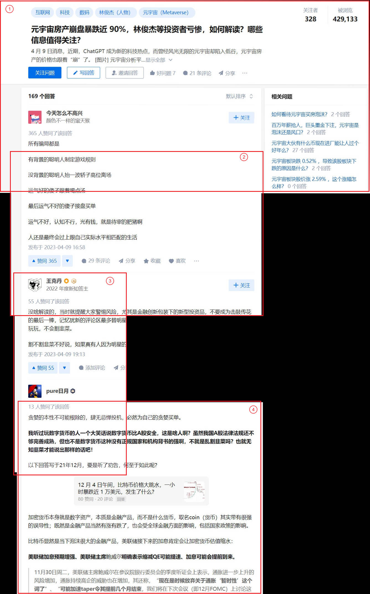

# imstitch

## Description

The program is designed to identify corresponding points between images and integrate them to form a seamless composite. 

For successful integration, the images must either be oriented in the same direction or possess an overlapping region with a smooth transition between them. Moreover, the overlapping area must be sufficiently large to ensure an adequate number of matching points can be identified.

The user just use the screenshot software they love and take a series of shoot. The program will stitch them to form a long single image.

Example: the red boxes outline each single shot.




## requirement

* python (of course)
* opencv-python


## Usage

Try:

```bash
python imstitch -h
```

```
usage: imstitch.py [-h] [--output OUTPUT] [--dir DIR] [imgfiles ...]

The program is designed to identify corresponding points between images and
integrate them to form a seamless composite. For successful integration, the
images must either be oriented in the same direction or possess an overlapping
region with a smooth transition between them. Moreover, the overlapping area
must be sufficiently large to ensure an adequate number of matching points can
be identified.

positional arguments:
  imgfiles              Image files to stitch, if this is not specified, the
                        program will try to find all jpg files in the current
                        directory. If this is specified, and --dir is also
                        specified, the images in the --dir will be added to
                        the list.

options:
  -h, --help            show this help message and exit
  --output OUTPUT, -o OUTPUT
                        save path
  --dir DIR, -d DIR     directory of images
```


## LICENSE

MIT


## change log

> 2023/04/11
>
> restrict image deformation from general homography  transformation to simple transition transformation, which is more reasonable in the screenshot scenario.